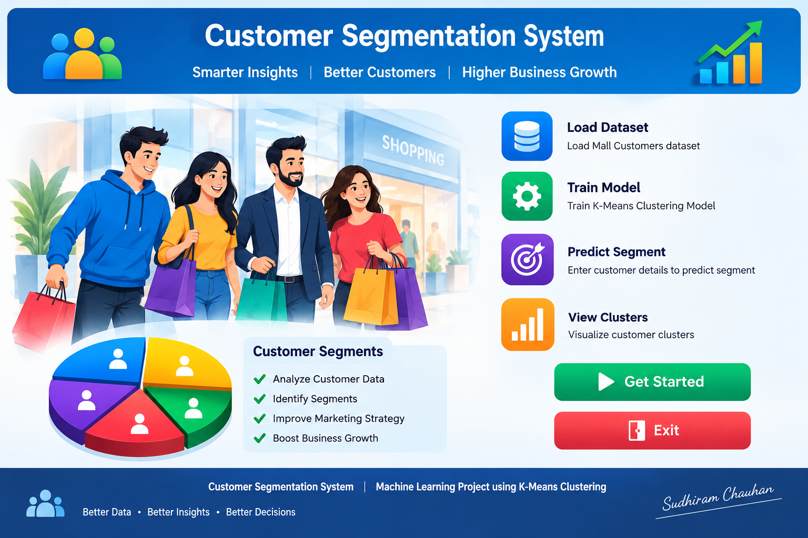
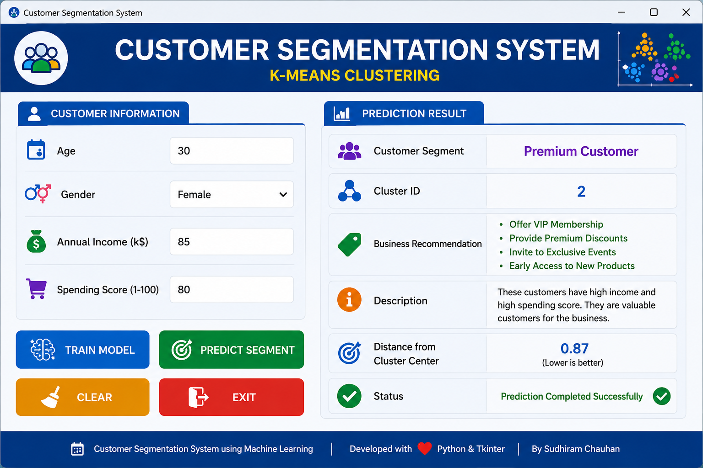

# Customer Segmentation System using K-Means Clustering

A professional **Machine Learning Desktop Application** developed using **Python**, **Tkinter**, and **K-Means Clustering** to segment customers based on their purchasing behavior. The application predicts the customer segment and provides business recommendations to help organizations improve marketing strategies.

---

# Project Overview

Customer Segmentation is an **Unsupervised Machine Learning** technique used to group customers with similar characteristics.

This project uses the **Mall Customers Dataset** and applies the **K-Means Clustering Algorithm** to divide customers into different groups based on:

- Age
- Gender
- Annual Income
- Spending Score

The application provides an easy-to-use graphical interface where users can enter customer details and instantly identify the predicted customer segment.

---

# Features

- Professional Tkinter GUI
- Train K-Means Model
- Automatic Model Saving
- Automatic Model Loading
- Predict Customer Segment
- Business Recommendations
- Customer Category Display
- Input Validation
- Clear Button
- Exit Button
- Cluster Visualization
- Elbow Method Graph

---

# Technologies Used

| Technology | Purpose |
|------------|---------|
| Python | Programming Language |
| Tkinter | Desktop GUI |
| Pandas | Data Processing |
| NumPy | Numerical Computing |
| Scikit-learn | Machine Learning |
| Matplotlib | Data Visualization |
| Joblib | Save and Load Models |

---

# Project Structure

```text
Customer_Segmentation_System/
│
├── Mall_Customers.csv
├── main.py
├── train_model.py
├── utils.py
├── model.pkl
├── scaler.pkl
├── features.pkl
├── requirements.txt
├── README.md
│
└── images/
    ├── home.png
    └── prediction.png
```

---

# Dataset

**Dataset Name**

Mall Customers Dataset

**Features**

| Feature | Description |
|----------|-------------|
| CustomerID | Customer ID |
| Gender | Male / Female |
| Age | Customer Age |
| Annual Income (k$) | Annual Income |
| Spending Score (1-100) | Customer Spending Score |

---

# Machine Learning Workflow

```text
Load Dataset
      │
      ▼
Data Preprocessing
      │
      ▼
Feature Selection
      │
      ▼
Feature Scaling
      │
      ▼
Elbow Method
      │
      ▼
Train K-Means Model
      │
      ▼
Save Model
      │
      ▼
Load Model in GUI
      │
      ▼
Predict Customer Segment
      │
      ▼
Display Business Recommendation
```

---

# Customer Segments

| Cluster | Customer Type | Business Strategy |
|---------|---------------|-------------------|
| 0 | Budget Customer | Discount Coupons |
| 1 | Regular Customer | Loyalty Rewards |
| 2 | Premium Customer | VIP Membership |
| 3 | High Income, Low Spending | Personalized Offers |
| 4 | High Spending Customer | Exclusive Products |

---

# GUI Preview

## Home Screen

```
images/home.png
```

## Prediction Screen

```
images/prediction.png
```

---

# Installation

## Clone Repository

```bash
git clone https://github.com/yourusername/Customer_Segmentation_System.git
```

## Move to Project Folder

```bash
cd Customer_Segmentation_System
```

## Install Dependencies

```bash
pip install -r requirements.txt
```

---

# Train the Model

Run:

```bash
python train_model.py
```

This will generate:

- model.pkl
- scaler.pkl
- features.pkl

---

# Run the Application

```bash
python main.py
```

---

# Application Workflow

1. Open the application.
2. Click **Train Model** (only the first time).
3. Enter:
   - Age
   - Gender
   - Annual Income
   - Spending Score
4. Click **Predict Segment**.
5. View:
   - Cluster Number
   - Customer Category
   - Business Recommendation

---

# Example Prediction

**Input**

- Age: 30
- Gender: Female
- Annual Income: 85
- Spending Score: 80

**Output**

```text
Customer Type:
Premium Customer

Cluster:
2

Recommendation:
• VIP Membership
• Premium Discounts
• Exclusive Product Offers
• Early Access to New Products
```

---

# Future Improvements

- Export Prediction Report (PDF)
- Save Prediction History
- Customer Dashboard
- Dark Mode
- Login System
- Database Integration
- Real-Time Analytics
- Interactive Cluster Visualization

---

# Learning Outcomes

By completing this project, you will learn:

- Unsupervised Machine Learning
- K-Means Clustering
- Feature Scaling
- StandardScaler
- Elbow Method
- Silhouette Score
- Model Serialization using Joblib
- Tkinter GUI Development
- Python Project Structure

---

# Screenshots

### Home Screen



---

### Prediction Screen



---

# Author

**Sudhiram Chauhan**

AI Trainer | Data Scientist | Machine Learning Enthusiast

---

# License

This project is created for educational purposes.

Feel free to use, modify, and improve it for learning and academic projects.

---

## ⭐ If you found this project helpful, consider giving it a star on GitHub!